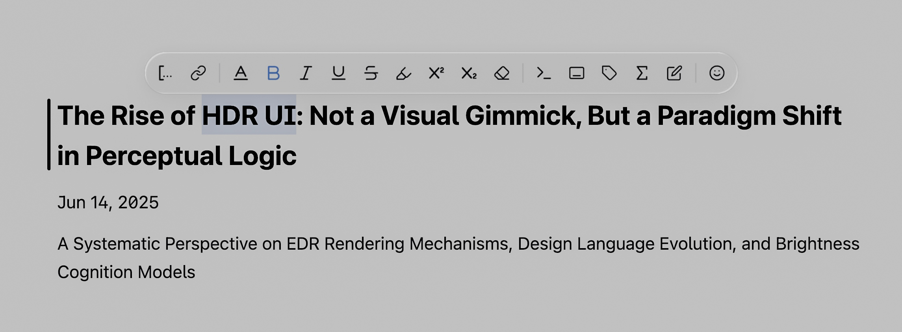

# Apple HEIC to EXR Converter

A Python tool to convert Apple HDR HEIC files to EXR format while preserving HDR information. This tool extracts gain maps from Apple's proprietary HDR format and synthesizes them into standard HDR EXR files.

## Background



macOS Tahoe introduced HDR screenshot support, but the generated HEIC files with HDR information can only be viewed on Apple devices. This tool converts Apple HDR format to standard EXR format for easy sharing and editing in software like Adobe Photoshop, Camera Raw, and Affinity Photo, etc.

---

**Important:**

> To ensure full HDR information is preserved, you must first export your photo from the Mac Photos app as a JPEG, and in the export dialog, set the "Color Profile" to **Original**. Only this export method will include the Apple HDR gain map in the JPEG file. Directly using HEIC or other export options will not preserve the HDR gain map.

---

## Features

- ✅ Extracts gain maps from Apple HDR JPEG files (MPF format)
- ✅ Preserves HDR dynamic range information
- ✅ Converts to industry-standard EXR format
- ✅ Supports both HEIC and Apple HDR JPEG inputs
- ✅ Configurable tone mapping options
- ✅ Cross-platform compatibility

## Prerequisites

### Required Software

1. **Python 3.8+**
2. **ExifTool** - For extracting metadata and gain maps
   - macOS: `brew install exiftool`
   - Ubuntu/Debian: `sudo apt-get install exiftool`
   - Windows: Download from [ExifTool website](https://exiftool.org/)

### Python Dependencies

Install the required Python packages:

```bash
pip install numpy pillow opencv-python openexr
```

Or install from requirements.txt:

```bash
pip install -r requirements.txt
```

## Installation

1. Clone this repository:
```bash
git clone https://github.com/yourusername/appleheic2exr.git
cd appleheic2exr
```

2. Install dependencies:
```bash
pip install -r requirements.txt
```

3. Verify ExifTool installation:
```bash
exiftool -ver
```

## Usage

### Basic Usage

Convert an Apple HDR JPEG to EXR:

```bash
python apple_hdr_converter.py input.jpg output.exr
```

### Advanced Options

```bash
# Convert with tone mapping (reduces brightness for SDR displays)
python apple_hdr_converter.py input.jpg output.exr --tone-mapping

# Convert to PNG format (16-bit)
python apple_hdr_converter.py input.jpg output.png --format png

# Convert HEIC files (requires sips on macOS)
python heic_converter.py input.heic output.exr
```

### Command Line Options

- `input`: Input Apple HDR JPEG or HEIC file
- `output`: Output file path
- `--format`: Output format (`exr` or `png`, default: `exr`)
- `--tone-mapping`: Apply tone mapping to reduce brightness

## Supported Input Formats

### Apple HDR JPEG
- Files exported from Mac Photos app with HDR enabled
- Contains MPF (Multi-Picture Format) with gain map
- Automatically extracts gain map and metadata

### Apple HDR HEIC
- Native Apple HDR format
- Uses macOS `sips` tool for conversion
- Limited to macOS systems

## How It Works

1. **Gain Map Extraction**: Uses ExifTool to extract the gain map from MPF format
2. **Metadata Analysis**: Reads HDR capacity, gamma, and offset information
3. **HDR Synthesis**: Applies gain map to base image using Apple's algorithm
4. **Output Generation**: Saves as EXR with preserved HDR information

## File Structure

```
appleheic2exr/
├── README.md
├── LICENSE
├── requirements.txt
├── apple_hdr_converter.py      # Main converter for Apple HDR JPEG
├── heic_converter.py           # Converter for HEIC files
├── analyze_apple_hdr_jpeg.py   # Analysis tool for debugging
└── examples/
    └── sample_output.exr
```

## Examples

### Convert Apple HDR JPEG
```bash
# Basic conversion
python apple_hdr_converter.py photo.jpg photo.exr

# With tone mapping for SDR displays
python apple_hdr_converter.py photo.jpg photo_sdr.exr --tone-mapping
```

### Convert HEIC (macOS only)
```bash
python heic_converter.py photo.heic photo.exr
```

### Analyze HDR Information
```bash
python analyze_apple_hdr_jpeg.py photo.jpg
```

## Troubleshooting

### Common Issues

1. **"ExifTool not found"**
   - Install ExifTool: `brew install exifool` (macOS) or `sudo apt-get install exiftool` (Linux)

2. **"OpenEXR not available"**
   - Install OpenEXR: `pip install openexr`

3. **"No gain map found"**
   - Ensure input file is an Apple HDR JPEG with MPF format
   - Check if file was exported from Mac Photos app with HDR enabled

4. **"Overly bright output"**
   - Use `--tone-mapping` flag to reduce brightness
   - Try different output formats

### Debug Mode

For detailed analysis of HDR information:

```bash
python analyze_apple_hdr_jpeg.py input.jpg
```

This will show:
- Gain map statistics
- HDR capacity information
- Image metadata

## Technical Details

### HDR Synthesis Algorithm

The tool implements Apple's gain map algorithm:

```
HDR = SDR × (1 + (headroom - 1) × gain_map)
```

Where:
- `headroom` = HDR capacity max / min
- `gain_map` = Extracted gain map (normalized)
- `SDR` = Base image

### Supported Color Spaces

- Display P3 (Apple's default)
- sRGB (fallback)
- BT.2020 (EXR output)

## Acknowledgments

- Apple for the HDR gain map format
- ExifTool for metadata extraction
- OpenEXR for HDR file format support
- **Cursor** - All Python code in this repository was generated by Cursor AI

## Support

If you encounter issues or have questions:

1. Check the troubleshooting section
2. Open an issue on GitHub
3. Include input file format and error messages

---

**Note**: This tool is designed for Apple HDR files. For other HDR formats, consider using specialized tools like `ffmpeg` or `ImageMagick`. 