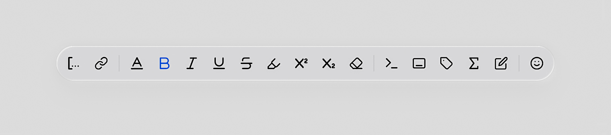

# Apple HEIC to EXR 转换器

[English](README.md) | 中文

一个Python工具，用于将Apple HDR HEIC文件转换为EXR格式，同时保留HDR信息。该工具从Apple专有的HDR格式中提取增益映射，并将其合成为标准的HDR EXR文件。

## 背景



macOS Tahoe引入了HDR截图支持，但生成的包含HDR信息的HEIC文件只能在Apple设备上查看。此工具将Apple HDR格式转换为标准EXR格式，便于在Adobe Photoshop、Camera Raw和Affinity Photo等软件中轻松分享和编辑。

---

> [!IMPORTANT]
> 为确保完整保留HDR信息，您必须首先从Mac照片应用中将照片导出为JPEG格式，并在导出对话框中将"颜色配置文件"设置为**原始状态**。只有这种导出方法才会在JPEG文件中包含Apple HDR增益映射。直接使用HEIC或其他导出选项将不会保留HDR增益映射。

---

## 安装

安装依赖：
```bash
pip install -r requirements.txt
```

安装ExifTool：
- macOS: `brew install exiftool`
- Ubuntu/Debian: `sudo apt-get install exiftool`
- Windows: 从[ExifTool网站](https://exiftool.org/)下载

## 使用方法

### 转换Apple HDR JPEG为EXR
```bash
python apple_hdr_converter.py input.jpeg output.exr
```

### 转换HEIC为EXR（仅限macOS）
```bash
python heic_converter.py input.heic output.exr
```

### 选项
- `--tone-mapping`: 应用色调映射以降低SDR显示器的亮度
- `--format png`: 输出为16位PNG而非EXR

### 示例
```bash
# 基本转换
python apple_hdr_converter.py photo.jpg photo.exr

# 使用色调映射
python apple_hdr_converter.py photo.jpg photo.exr --tone-mapping

# 转换为PNG
python apple_hdr_converter.py photo.jpg photo.png --format png
```
---

（此仓库中的所有Python代码均由Cursor AI生成）